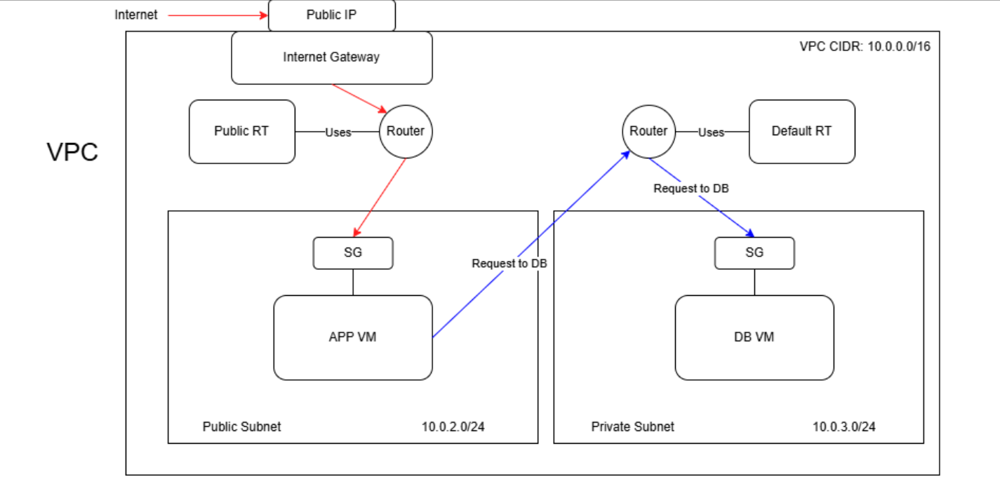
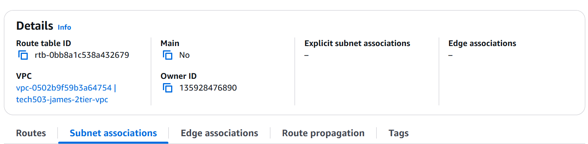
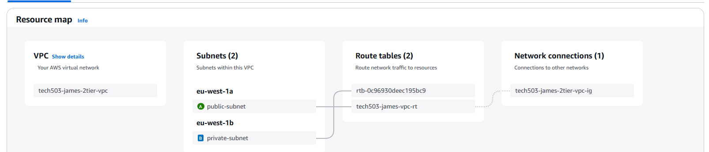

# VPCs Notes

[What is Amazon VPC?](https://docs.aws.amazon.com/vpc/latest/userguide/what-is-amazon-vpc.html)

[Amazon VPC documentation](https://docs.aws.amazon.com/vpc/#:~:text=Amazon%20Virtual%20Private%20Cloud%20(Amazon,network%20that%20you've%20defined.))

### What are VPCs and how do they work? 

***VPC*** (Virtual private cloud): A private, isolated network within a public cloud infrastructure that allows an organization to isolate and control its own resources and network infrastructure.

***Representation of VPC within the public cloud***


***Representation of a VPC and its resources in AWS***


***Better VPC representation***


### How do VPCs help a business?

- ***Security***: VPCs provide a secure, isolated network environment within the public cloud. Businesses can ensure that their resources are protected from other users of the cloud.
- ***Flexibility***: 
  - Allow for custom network architecture
  - Make it easier to set up hybrid cloud integrations
- ***Scalability***: 
- ***Cost efficiency***:
- ***All the same benifits of other cloud comuting services***

From [Amazon](https://aws.amazon.com/vpc/):
- ***Increase security***: Secure and monitor connections, screen traffic, and restrict instance access inside your virtual network
- ***Save time***: Spend less time setting up, managing, and validating your virtual network
- ***Manage and control your environment***: Customize your virtual network by choosing your own IP address range, creating subnets, and configuring route tables 

### How do they help with DevOPs?

- ***Separation of Environments***: In a VPC, you can create separate subnets for different stages of the application lifecycle, such as development, testing, and production
- ***CI/CD***: Provide the network infrastructure necessary to deploy applications in a secure and isolated environment
- ***Containerization***: VPCs can provide a secure network for managing containerized applications
- ***Scalability***: Auto-scaling
- ***Monitoring***: Can use monitoring tools like Cloudwatch
- ***Consistency Across Environments***: DevOps teams can easily replicate production-like environments in staging and testing environments, reducing the risk of deployment failures. This makes it easier to run automated tests and perform integration testing before pushing changes to production.

### Why did AWS feel the need to introduce VPCs?

[Introducing Amazon VPC](https://aws.amazon.com/about-aws/whats-new/2009/08/26/introducing-amazon-virtual-private-cloud/)

"Amazon Virtual Private Cloud (Amazon VPC) is a secure and seamless bridge between a company’s existing IT infrastructure and the AWS cloud. Amazon VPC enables enterprises to connect their existing infrastructure to a set of isolated AWS compute resources via a Virtual Private Network (VPN) connection, and to extend their existing management capabilities such as security services, firewalls, and intrusion detection systems to include their AWS resources."

### Components:

- ***Subnets***: You can divide a VPC into subnets to organize and isolate resources based on various requirements
- ***Public vs Private Subnets***
  - ***Public***: Has direct access to the internet. Resources in a public subnet can communicate with the internet using an Internet Gateway (IGW)
  - ***Private***: Isolated from direct internet access. Typically don't have public IP addresses. Route traffic through a NAT Gateway or NAT instance to allow outbound internet access
- ***[CIDR](https://aws.amazon.com/what-is/cidr/#:~:text=CIDR%20notation%20represents%20an%20IP,bit%20network%20identifier%20as%20192.168.) Blocks*** (Classless Inter-Domain Routing block): 
  - Used to define the range of IP addresses available within a VPC or subnet
  - ***Notation***: CIDR notation represents an IP address and a suffix that indicates network identifier bits in a specified format. For example, you could express ```192.168.1.0``` with a 22-bit network identifier as ```192.168.1.0/22```

- ***Internet Gateways***: Allows communication between instances in your VPC and the internet
- ***Route Table/s***: A set of rules (called routes) used to determine where network traffic from your VPC is directed
- ***SG*** (Security group): 
  - Virtual firewalls used to control inbound and outbound traffic to AWS resources
  - How SGs work on an INSTANCE level: A security group is associated with an instance. Define which ports are open.

# VPC setup

## VPC

### VPC

- Search VPC in searchbar
- Your VPCs: Create VPC
- Resources: VPC only
- Name: tech503-james-2tier-vpc
- IPv4 CIDR: 10.0.0.0/16
- Create VPC

### Subnets

- Create subnet
- VPC ID: select the one you created
- Subnet 1:
  - Name: public-subnet
  - Availability zone: eu-west-1a
  - IPv4 Subnet CIDR block: 10.0.2.0/24 
- Subnet 2:
  - Name: private-subnet
  - Availability zone: eu-west-1b
  - IPv4 Subnet CIDR block: 10.0.3.0/24 
- Create

### Internet Gateways

- Create
- Name: tech503-james-2tier-vpc-ig
- Create
- Attatch to VPC: select your vpc

### Route tables

- Create
- Name: tech503-james-vpc-rt
- VPC: select yours
- Create

- Subnet associations: 
  - Edit
  - Select public subnet
  - Save associations
- Routes:
  - Edit
  - Add route
  - Destination: 0.0.0.0/0
  - Target: 
    - Internet gateway 
    - Select yours

***VPC resource map***


## Instances

### Database instance

- Create instance
- Name: tech503-james-db-for-vpc
- AMI: tech503-james-db-image-mk2
- Add usual key-pair
- Network settings:
  - Edit
  - VPC: select yours
  - Subnet: Private subnet
  - Auto-assign public IP: Disable
  - Create security group:
    - Name: tech503-james-db-vpc-sg
    - Add security group rule:
      - Port range: 27017
      - Source 0.0.0.0/0
- Launch instance

**If done correctly, your DB instance won't have a public IP address**

### App instance

- Create instance
- Name: tech503-james-app-for-vpc
- AMI: tech503-james-app-image
- Add usual key-pair
- Network settings:
  - Edit
  - VPC: select yours
  - Subnet: Public subnet
  - Auto-assign public IP: Enable
  - Create security group:
    - Name: tech503-james-app-vpc-sg
    - Add security group rule:
      - Port range: 80
      - Source 0.0.0.0/0
- Advanced details:
  - User data: (Need to manually insert DB private IP)
```
#!/bin/bash

#Swap user to ubuntu
sudo -u ubuntu -i << EOF
echo "Running as the ubuntu user"

#Swap to ubuntu home directory
cd

#Wait for image script to run
sleep 20

cd nodejs-sparta-test-app
cd app

#Install npm
sudo npm install

sleep 5

#Need to manually insert <db-private-ip-address>
export DB_HOST=mongodb://<db-private-ip-address>:27017/posts
printenv DB_HOST

sleep 5

#Seed the posts database
node seeds/seed.js

sleep 5
 
# run the app with pm2 (in the background by default)
pm2 start app.js

#Stop being ubuntu as user
EOF
```
- Launch instance

**Use Public IP of app instance to access the app**

## Delete Order

1) Terminate instances
2) Security groups (Found in the VPC dashboard)
3) VPC

Deleting the VPC will automatically delete:

1) Internet gateways
2) Route tables
3) Subnets